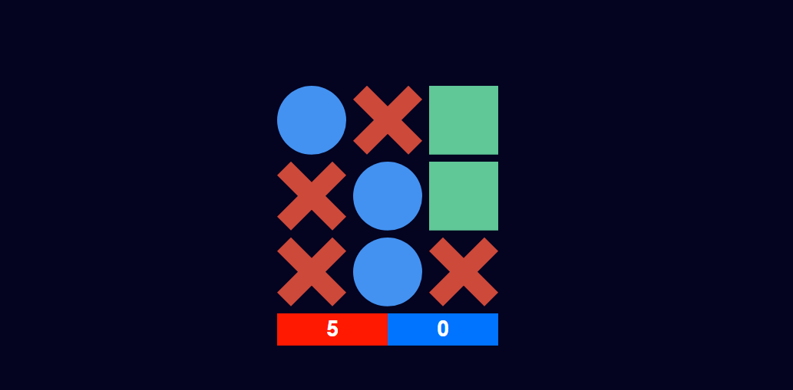

# Tate Ti Simple Game

## Hello, this is one of my first practice projects, I used the technologies: React, Js, CSS

In the project directory, you can run:
### `npm install`
### `npm start`

Runs the app in the development mode.\
Open [http://localhost:3000](http://localhost:3000) to view it in the browser.

